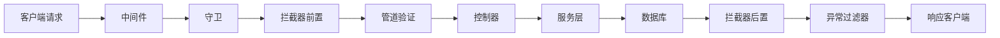

# 🚀 全栈开发脚手架 - 开发指南

## 📋 项目概览

这是一个基于 **NestJS + React + Prisma + Supabase** 的现代化全栈开发脚手架，集成了完整的用户认证、邮件验证、微信登录等功能。

### 🏗️ 技术栈

**后端 (NestJS)**
- **框架**: NestJS (Node.js)
- **数据库**: PostgreSQL (Supabase)
- **ORM**: Prisma
- **认证**: JWT + Passport
- **邮件**: Resend / SMTP
- **文档**: Swagger
- **部署**: Docker + 华为云

**前端 (React)**
- **框架**: React 18 + TypeScript
- **状态管理**: MobX
- **UI 组件**: Ant Design
- **样式**: Tailwind CSS
- **路由**: React Router
- **HTTP**: Axios
- **部署**: Vercel / 静态托管

## 🚀 快速开始

### 1. 环境准备

```bash
# 安装依赖管理器
npm install -g pnpm

# 克隆项目
git clone <your-repo>
cd my-fullstack-starter

# 安装依赖
pnpm install
```

### 2. 数据库配置

1. **创建 Supabase 项目**
   - 访问 [supabase.com](https://supabase.com)
   - 创建新项目
   - 获取数据库连接字符串

2. **配置环境变量**
```bash
# 后端配置 (.env.production)
DATABASE_URL="postgresql://..."
DIRECT_URL="postgresql://..."
JWT_SECRET="your-jwt-secret"
JWT_REFRESH_SECRET="your-refresh-secret"
FRONTEND_URL="https://your-frontend-domain.com"

# 邮件配置 (选择一种)
# Resend (推荐)
RESEND_API_KEY="re_your_api_key"
EMAIL_FROM="noreply@yourdomain.com"

# 或 SMTP
USE_SMTP=true
SMTP_HOST="smtp.gmail.com"
SMTP_PORT=587
SMTP_USER="your-email@gmail.com"
SMTP_PASS="your-app-password"

# 微信配置
WECHAT_APP_ID="your_wechat_app_id"
WECHAT_APP_SECRET="your_wechat_app_secret"
WECHAT_TOKEN="your_webhook_token"
```

3. **初始化数据库**
```bash
cd nest-supabase-prisma
pnpm prisma generate
pnpm prisma db push
```

### 3. 启动开发环境

```bash
# 启动后端
cd nest-supabase-prisma
pnpm run start:dev

# 启动前端
cd react-mobx-tailwindcss
pnpm run dev
```

## 🏗️ 项目架构

### 后端架构 (NestJS)

```
src/
├── main.ts                 # 应用入口
├── app.module.ts           # 根模块
├── auth/                   # 认证模块
│   ├── auth.controller.ts  # 认证控制器
│   ├── auth.service.ts     # 认证服务
│   ├── jwt.strategy.ts     # JWT 策略
│   └── dto/               # 数据传输对象
├── users/                  # 用户模块
│   ├── users.controller.ts
│   ├── users.service.ts
│   └── entities/
├── mail/                   # 邮件模块
│   ├── mail.service.ts
│   ├── smtp.service.ts
│   └── templates/
├── wechat/                 # 微信模块
├── common/                 # 公共模块
│   ├── filters/           # 异常过滤器
│   ├── interceptors/      # 拦截器
│   ├── guards/            # 守卫
│   └── middlewares/       # 中间件
└── prisma/                # 数据库模块
```

### 前端架构 (React)

```
src/
├── main.tsx               # 应用入口
├── App.tsx               # 根组件
├── pages/                # 页面组件
│   ├── login/            # 登录页
│   ├── dashboard/        # 仪表板
│   └── verify-email/     # 邮箱验证
├── components/           # 公共组件
├── services/             # API 服务
│   ├── auth.ts          # 认证 API
│   └── http/            # HTTP 配置
├── store/               # 状态管理
│   ├── index.ts         # 全局状态
│   └── Env.ts           # 环境初始化
├── utils/               # 工具函数
└── types/               # 类型定义
```

## 🔄 HTTP 请求处理流程



### 统一响应格式

**成功响应**
```json
{
  "code": 0,
  "data": { ... },
  "message": "success"
}
```

**错误响应**
```json
{
  "code": 400,
  "data": null,
  "message": "请求参数错误"
}
```

## 🔐 认证系统

### JWT 认证流程

1. **用户登录** → 验证凭据 → 生成 JWT Token
2. **Token 刷新** → 使用 Refresh Token 获取新的 Access Token
3. **请求认证** → 在请求头中携带 `Authorization: Bearer <token>`
4. **Token 验证** → JWT Guard 验证 Token 有效性

### 邮箱验证流程

1. **用户注册** → 发送验证邮件
2. **点击链接** → 验证 Token
3. **激活账户** → 更新验证状态

### 状态码规范

- **200** - 成功
- **401** - 未认证 (未登录/Token 无效)
- **403** - 已认证但权限不足 (如邮箱未验证)
- **404** - 资源不存在
- **500** - 服务器错误

## 📧 邮件系统

### Resend 配置 (推荐)

1. **注册 Resend 账号**: https://resend.com
2. **验证域名**: 在 Resend 控制台添加并验证您的域名
3. **获取 API Key**: 创建 API Key
4. **配置环境变量**:
```bash
RESEND_API_KEY="re_your_actual_api_key"
EMAIL_FROM="noreply@yourdomain.com"
```

### SMTP 配置 (备选)

```bash
USE_SMTP=true
SMTP_HOST="smtp.gmail.com"
SMTP_PORT=587
SMTP_USER="your-email@gmail.com"
SMTP_PASS="your-app-password"
EMAIL_FROM="your-email@gmail.com"
```

## 🔧 开发新功能

### 1. 数据库设计

```prisma
// prisma/schema.prisma
model YourEntity {
  id        Int      @id @default(autoincrement())
  name      String
  createdAt DateTime @default(now())
  updatedAt DateTime @updatedAt
}
```

### 2. 创建 DTO

```typescript
// src/your-module/dto/create-your-entity.dto.ts
import { ApiProperty } from '@nestjs/swagger';
import { IsNotEmpty, IsString } from 'class-validator';

export class CreateYourEntityDto {
  @IsString()
  @IsNotEmpty()
  @ApiProperty({ required: true })
  name: string;
}
```

### 3. 创建 Service

```typescript
// src/your-module/your-module.service.ts
@Injectable()
export class YourModuleService {
  constructor(private prisma: PrismaService) {}

  async create(createDto: CreateYourEntityDto) {
    return this.prisma.yourEntity.create({
      data: createDto,
    });
  }

  async findAll() {
    return this.prisma.yourEntity.findMany();
  }
}
```

### 4. 创建 Controller

```typescript
// src/your-module/your-module.controller.ts
@ApiTags('YourModule')
@Controller('your-module')
export class YourModuleController {
  constructor(private readonly service: YourModuleService) {}

  @Post()
  @ApiCreatedResponse({ type: YourEntity })
  create(@Body() createDto: CreateYourEntityDto) {
    return this.service.create(createDto);
  }

  @Get()
  @UseGuards(JwtAuthGuard)
  @ApiOkResponse({ type: YourEntity, isArray: true })
  findAll() {
    return this.service.findAll();
  }
}
```

### 5. 创建 Module

```typescript
// src/your-module/your-module.module.ts
@Module({
  imports: [PrismaModule],
  controllers: [YourModuleController],
  providers: [YourModuleService],
  exports: [YourModuleService],
})
export class YourModuleModule {}
```

### 6. 注册到 AppModule

```typescript
// src/app.module.ts
@Module({
  imports: [
    // ... 其他模块
    YourModuleModule,
  ],
})
export class AppModule {}
```

## 🚀 部署指南

### 后端部署 (华为云)

1. **构建 Docker 镜像**
```bash
cd nest-supabase-prisma
docker build -t my-backend .
```

2. **推送到镜像仓库**
```bash
docker tag my-backend your-registry/my-backend
docker push your-registry/my-backend
```

3. **部署到服务器**
```bash
# 使用提供的部署脚本
./simple-deploy.sh
```

### 前端部署 (Vercel)

1. **连接 GitHub 仓库**
2. **配置环境变量**
```bash
VITE_API_BASE_URL=https://your-backend-domain.com/api
VITE_APP_ENV=production
```
3. **自动部署**

## 🔍 调试和监控

### 日志系统

- **开发环境**: 控制台输出详细日志
- **生产环境**: 结构化日志，支持文件输出
- **业务日志**: 关键操作记录

### API 文档

- **Swagger**: http://localhost:3000/docs
- **自动生成**: 基于装饰器自动生成 API 文档

### 错误处理

- **全局异常过滤器**: 统一错误格式
- **业务异常**: 自定义错误码和消息
- **验证错误**: 自动参数验证

## 📚 最佳实践

### 代码规范

1. **使用 TypeScript** - 类型安全
2. **遵循 SOLID 原则** - 单一职责、开闭原则等
3. **模块化设计** - 功能模块独立
4. **统一响应格式** - 前后端数据格式一致

### 安全实践

1. **JWT Token 管理** - 短期 Access Token + 长期 Refresh Token
2. **密码安全** - bcrypt 加密存储
3. **输入验证** - 使用 class-validator 验证
4. **CORS 配置** - 限制跨域访问
5. **速率限制** - 防止 API 滥用

### 性能优化

1. **数据库索引** - 关键字段建立索引
2. **连接池** - Prisma 自动管理
3. **缓存策略** - Redis 缓存热点数据
4. **分页查询** - 大数据量分页处理

## 🤝 贡献指南

1. **Fork 项目**
2. **创建功能分支** (`git checkout -b feature/AmazingFeature`)
3. **提交更改** (`git commit -m 'Add some AmazingFeature'`)
4. **推送分支** (`git push origin feature/AmazingFeature`)
5. **创建 Pull Request**

## 📄 许可证

本项目采用 MIT 许可证 - 查看 [LICENSE](LICENSE) 文件了解详情。

## 🆘 常见问题

### Q: 邮件发送失败怎么办？
A: 检查 Resend API Key 是否正确，域名是否已验证。可以临时切换到 SMTP 模式。

### Q: 微信登录配置问题？
A: 确保微信公众号配置正确，IP 白名单已添加服务器 IP。

### Q: 数据库连接失败？
A: 检查 Supabase 连接字符串是否正确，网络是否可达。

### Q: 前端部署后 API 调用失败？
A: 检查 CORS 配置，确保前端域名在后端允许列表中。

## 📖 详细功能说明

### 用户认证系统

#### 注册流程
1. 用户填写注册信息（邮箱、密码、姓名）
2. 后端验证密码强度和邮箱格式
3. 生成验证 Token 并发送验证邮件
4. 返回 JWT Token（允许未验证用户登录）
5. 用户点击邮件链接完成验证

#### 登录流程
1. 用户输入邮箱和密码
2. 后端验证凭据
3. 生成 Access Token (15分钟) 和 Refresh Token (7天)
4. 返回用户信息和 Token
5. 前端保存 Token 到 localStorage

#### Token 刷新机制
```typescript
// 自动刷新 Token 的拦截器
if (status === 401) {
  const refreshToken = localStorage.getItem('refresh_token');
  if (refreshToken) {
    // 尝试刷新 Token
    const newTokens = await refreshAccessToken(refreshToken);
    // 重试原始请求
    return retryOriginalRequest(newTokens.access_token);
  }
}
```

### 邮件验证系统

#### 邮件模板
- **验证邮件**: 包含验证链接和用户信息
- **密码重置**: 包含重置链接和安全提示
- **响应式设计**: 适配各种邮件客户端

#### 邮件服务配置
```typescript
// 智能邮件服务选择
if (useSmtp && smtpHost) {
  // 使用 SMTP 服务
  this.smtpService = new SmtpService(configService);
} else if (resendApiKey) {
  // 使用 Resend 服务
  this.resend = new Resend(apiKey);
} else {
  // 开发模式 - 模拟发送
  this.mockEmailService = new MockEmailService();
}
```

### 微信登录集成

#### 微信公众号配置
1. **服务器配置**
   - URL: `https://your-domain.com/api/wechat/webhook`
   - Token: 在环境变量中配置
   - 消息加解密方式: 明文模式

2. **IP 白名单**
   - 添加服务器 IP 到微信公众平台
   - 确保网络连通性

#### 扫码登录流程
1. 前端生成二维码场景值
2. 用户扫码关注公众号
3. 微信推送事件到后端 Webhook
4. 后端处理用户信息并生成 Token
5. 前端轮询获取登录状态

### 数据库设计

#### 核心表结构
```sql
-- 用户表
CREATE TABLE "User" (
  "id" SERIAL PRIMARY KEY,
  "email" TEXT UNIQUE,
  "name" TEXT NOT NULL,
  "password" TEXT,
  "isVerified" BOOLEAN DEFAULT false,
  "verifyToken" TEXT,
  "resetToken" TEXT,
  "resetTokenExpiry" TIMESTAMP,
  "loginAttempts" INTEGER DEFAULT 0,
  "lockExpires" TIMESTAMP,
  "twoFactorEnabled" BOOLEAN DEFAULT false,
  "twoFactorSecret" TEXT,
  "wechatOpenId" TEXT UNIQUE,
  "wechatUnionId" TEXT UNIQUE,
  "createdAt" TIMESTAMP DEFAULT now()
);

-- Token 表 (Refresh Token)
CREATE TABLE "Token" (
  "id" SERIAL PRIMARY KEY,
  "value" TEXT UNIQUE NOT NULL,
  "userId" INTEGER REFERENCES "User"("id"),
  "expiresAt" TIMESTAMP NOT NULL,
  "deviceId" TEXT,
  "userAgent" TEXT,
  "ipAddress" TEXT,
  "lastUsed" TIMESTAMP DEFAULT now()
);
```

## 🛠️ 开发工具和脚本

### 常用命令

```bash
# 后端开发
cd nest-supabase-prisma
pnpm run start:dev          # 开发模式启动
pnpm run build             # 构建生产版本
pnpm run test              # 运行测试
pnpm prisma studio         # 数据库可视化管理
pnpm prisma generate       # 生成 Prisma Client
pnpm prisma db push        # 推送 Schema 到数据库

# 前端开发
cd react-mobx-tailwindcss
pnpm run dev               # 开发模式启动
pnpm run build             # 构建生产版本
pnpm run preview           # 预览构建结果
pnpm run type-check        # 类型检查

# 部署
./simple-deploy.sh         # 一键部署脚本
```

### 环境变量管理

#### 后端环境变量
```bash
# .env.production
NODE_ENV=production
PORT=3000
DATABASE_URL="postgresql://..."
DIRECT_URL="postgresql://..."
JWT_SECRET="your-jwt-secret-32-chars-min"
JWT_REFRESH_SECRET="your-refresh-secret-32-chars-min"
FRONTEND_URL="https://your-frontend-domain.com"

# 邮件配置
RESEND_API_KEY="re_your_api_key"
EMAIL_FROM="noreply@yourdomain.com"

# 微信配置
WECHAT_APP_ID="your_wechat_app_id"
WECHAT_APP_SECRET="your_wechat_app_secret"
WECHAT_TOKEN="your_webhook_token"

# 安全配置
BCRYPT_SALT_ROUNDS=12
MAX_LOGIN_ATTEMPTS=5
ACCOUNT_LOCKOUT_TIME=30

# 日志配置
LOG_LEVEL=info
LOG_TO_FILE=true
LOG_DIR=/app/logs
```

#### 前端环境变量
```bash
# .env.production
VITE_API_BASE_URL=https://your-backend-domain.com/api
VITE_APP_ENV=production
VITE_APP_NAME=微信扫码登录系统
VITE_APP_VERSION=1.0.0
VITE_WECHAT_APP_ID=your_wechat_app_id
```

## 🔧 高级配置

### 自定义守卫

```typescript
// 邮箱验证守卫
@Injectable()
export class VerifiedUserGuard implements CanActivate {
  constructor(private usersService: UsersService) {}

  async canActivate(context: ExecutionContext): Promise<boolean> {
    const request = context.switchToHttp().getRequest();
    const user = request.user;

    const fullUser = await this.usersService.findOne(user.id);

    if (!fullUser?.isVerified) {
      throw new ForbiddenException('Email verification required');
    }

    return true;
  }
}

// 使用方式
@Post('sensitive-operation')
@UseGuards(JwtAuthGuard, VerifiedUserGuard)
async sensitiveOperation() {
  // 只有验证邮箱的用户才能执行
}
```

### 自定义拦截器

```typescript
// 日志拦截器
@Injectable()
export class LoggingInterceptor implements NestInterceptor {
  intercept(context: ExecutionContext, next: CallHandler): Observable<any> {
    const request = context.switchToHttp().getRequest();
    const { method, url, body, headers } = request;

    console.log(`📥 ${method} ${url}`, {
      body: this.sanitizeBody(body),
      userAgent: headers['user-agent'],
      ip: request.ip,
    });

    return next.handle().pipe(
      tap(() => {
        console.log(`📤 ${method} ${url} - Success`);
      }),
      catchError((error) => {
        console.error(`❌ ${method} ${url} - Error:`, error.message);
        throw error;
      }),
    );
  }
}
```

### 数据库优化

```typescript
// 分页查询
async findAllWithPagination(page: number, limit: number) {
  const skip = (page - 1) * limit;

  const [data, total] = await Promise.all([
    this.prisma.user.findMany({
      skip,
      take: limit,
      orderBy: { createdAt: 'desc' },
      select: {
        id: true,
        name: true,
        email: true,
        isVerified: true,
        createdAt: true,
      },
    }),
    this.prisma.user.count(),
  ]);

  return {
    data,
    pagination: {
      page,
      limit,
      total,
      totalPages: Math.ceil(total / limit),
    },
  };
}
```

## 🚀 性能优化建议

### 后端优化
1. **数据库索引**: 为常用查询字段添加索引
2. **连接池**: 配置合适的数据库连接池大小
3. **缓存策略**: 使用 Redis 缓存热点数据
4. **压缩**: 启用 gzip 压缩
5. **CDN**: 静态资源使用 CDN 加速

### 前端优化
1. **代码分割**: 使用 React.lazy 和 Suspense
2. **图片优化**: 使用 WebP 格式和懒加载
3. **Bundle 分析**: 定期分析打包体积
4. **缓存策略**: 合理设置缓存头
5. **预加载**: 关键资源预加载

## 🔒 安全最佳实践

### 认证安全
1. **密码策略**: 强制复杂密码
2. **账户锁定**: 多次失败后锁定账户
3. **Token 管理**: 短期 Access Token + 长期 Refresh Token
4. **设备管理**: 记录登录设备信息

### 数据安全
1. **输入验证**: 严格验证所有输入
2. **SQL 注入防护**: 使用 Prisma ORM
3. **XSS 防护**: 输出编码和 CSP
4. **CSRF 防护**: 使用 CSRF Token

### 网络安全
1. **HTTPS**: 强制使用 HTTPS
2. **CORS**: 严格配置跨域策略
3. **速率限制**: 防止 API 滥用
4. **安全头**: 配置安全相关的 HTTP 头

---

🎉 **恭喜！您已经掌握了这个全栈脚手架的核心概念。开始构建您的应用吧！**

## 📞 技术支持

如果您在使用过程中遇到问题，可以：

1. **查看文档**: 仔细阅读本文档和代码注释
2. **检查日志**: 查看控制台和服务器日志
3. **调试工具**: 使用浏览器开发者工具
4. **社区支持**: 在 GitHub Issues 中提问

**Happy Coding! 🚀**
